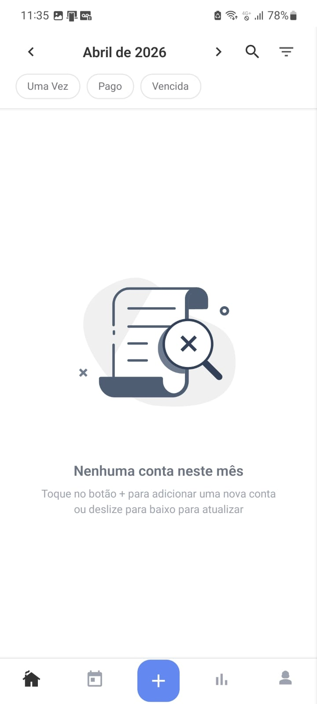
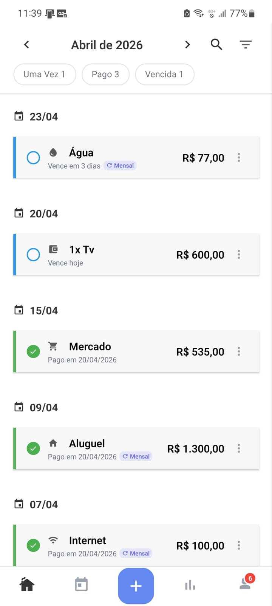
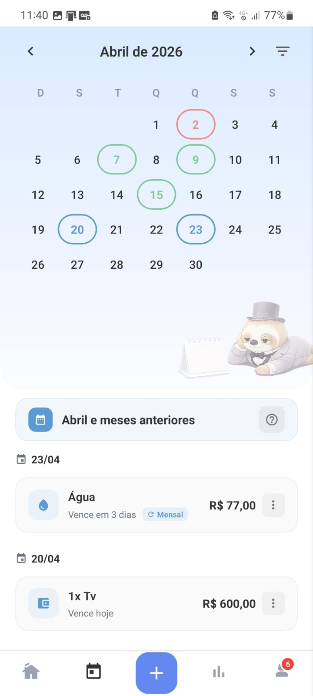
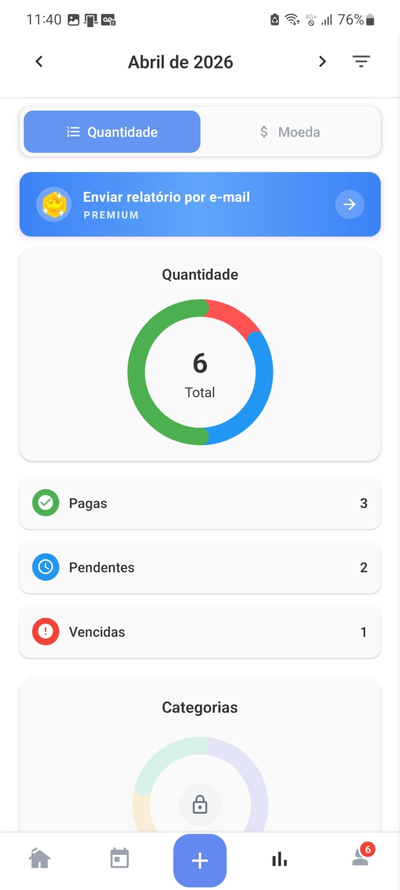

# 📱 No Prazo

🚀 Available on Google Play:  
👉 https://play.google.com/store/apps/details?id=com.noprazo

⚠️ This is a **showcase repository**. The source code is private and not publicly available.

---

## 🚀 About

No Prazo is a real-world mobile application designed to help users manage bills, due dates, and recurring payments in a simple and efficient way.

The app focuses on financial organization and productivity, allowing users to stay on top of their expenses and avoid missing payments.

---

## ✨ Features

* 📅 Bill and due date management
* 🔁 Recurring payments system
* 🔔 Smart reminders and notifications
* 📊 Monthly overview of expenses
* 💰 Subscription tracking
* 🎯 Clean and intuitive user interface

---

## 🛠️ Technologies

* React Native
* TypeScript
* Firebase (Authentication, Firestore, Notifications)
* REST APIs
* Firebase Cloud Messaging (Push Notifications)

---

## 📱 Screenshots

  
  
  
  

---

## 🎥 Demo

<!-- Add a short demo video or GIF here -->

---

## 💡 Notes

This application is used in a real-world scenario and was built with focus on performance, scalability, and user experience.

---

## 📩 Contact

If you’d like to know more about this project or request access to the source code, feel free to get in touch.
